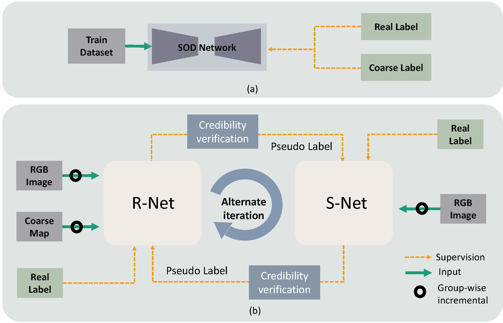
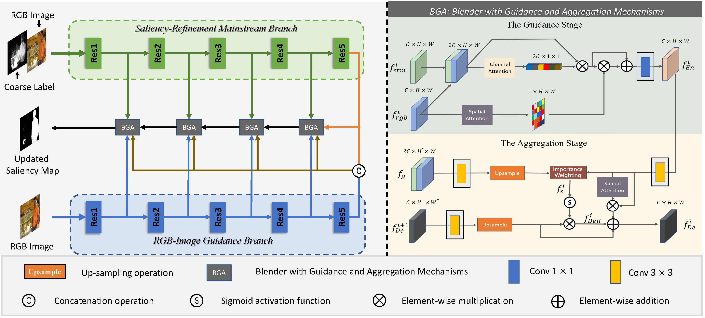
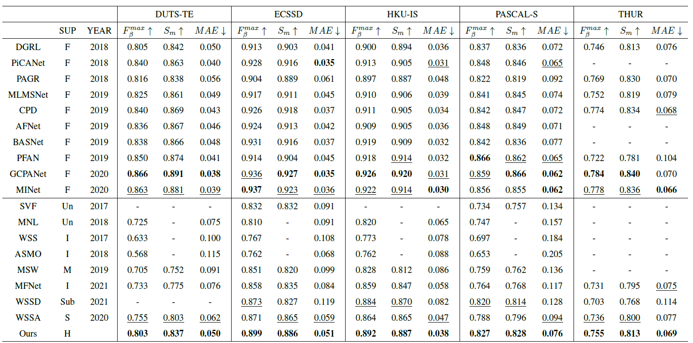

## WSLNet

This is a Mindspore implementation of "A Weakly Supervised Learning Framework for Salient Object Detection via Hybrid Labels" accepted by IEEE TCSVT 2022.

Paper: https://doi.org/10.1109/TCSVT.2022.3205182.

Arxiv version: https://arxiv.org/pdf/2209.02957.pdf

## Network

### Our overall framework(b)：



### Refine Network




## Requirement

Pleasure configure the environment according to the given version:

- python 3.8.5
- mindspore-gpu 1.9.0
- GPU cuda 11.1

## Data Preprocessing

 Please follow the tips to download the processed datasets and pre-trained model:

 1. Download training data  from [[Link](https://pan.baidu.com/s/1rE24g_NCsAoIUrp4bBrr0A)], code: mvpl.
2. Download testing data from [[Link](https://pan.baidu.com/s/1qrU_buTa8LpnE3f0GrDqlQ)], code: mvpl.


```python
├── data
    ├── coarse
    ├── DUTS
    ├── SOD
    ├── dataset.py 
    ├── transform.py
├── Network
    ├── rnet_down
    ├── rnet_up
    ├── snet
├── data_tset
├── test.py
├── train.py
```


## Training and Testing

**Training command** :
Please unzip the training data set to data\DUTS and unzip coarse maps of training data set to data\coarse.
```python
python train.py
```
Tips: Our validation set is 100 images from the SOD dataset.

**Testing command** :
Please unzip the testing data set to data_test.
```python
python test.py ours\xx.pt
```
**Tips**: We use Toolkit [[Link](https://github.com/zyjwuyan/SOD_Evaluation_Metrics)] to obtain the test metrics.


## Results

1. **Qualitative results**: we provide the saliency maps, you can download them from [[Link](https://pan.baidu.com/s/1yDlwuOgqTKkO3LDXqyfQ2w)], code: 0812.
2. **Quantitative results**: 




## Bibtex
```
@article{HybridSOD,
  title={A weakly supervised learning framework for salient object detection via hybrid labels},
  author={Cong, Runmin and Qin, Qi and Zhang, Chen and Jiang, Qiuping and Wang, Shiqi and Zhao, Yao and Kwong, Sam },
  journal={IEEE Transactions on Circuits and Systems for Video Technology},
  year={2022},
  publisher={IEEE}
}
  
```
## Contact Us
If you have any questions, please contact Runmin Cong at [rmcong@bjtu.edu.cn](mailto:rmcong@bjtu.edu.cn) or Qi Qin at [qiqin96@bjtu.edu.cn](mailto:qiqin96@bjtu.edu.cn).

